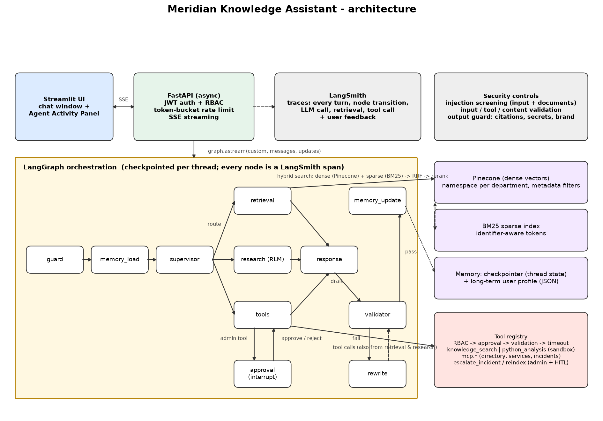

# Meridian Knowledge Assistant

An enterprise-grade AI assistant for a (fictional) commercial bank, **Meridian Commercial Bank**. Employees ask
questions in a chat window; a team of AI agents searches thousands of internal documents (policies, runbooks,
incident reports, architecture docs, specs, meeting notes), looks up live enterprise data, explains its
reasoning, cites its evidence and refuses to do anything the user's role does not allow.

Built with **Python · FastAPI · LangGraph · Pinecone · LangSmith · MCP · Streamlit · Claude**.

> **Demo video (4 min, live providers):** [docs/video/demo.mp4](docs/video/demo.mp4) - recorded automatically by
> `scripts/record_demo.py` (Playwright drives the UI, macOS `say` narrates, ffmpeg muxes). Re-record any time with
> `uv run python scripts/record_demo.py`.
>
> Non-technical readers: start with `docs/pdf/User_Guide.pdf` (what each part does, in plain English) and
> `docs/pdf/Questions_and_Answers.pdf` (questions you can ask and what to expect).

---

## Contents
1. [What it does](#1-what-it-does)
2. [Quick start](#2-quick-start)
3. [Demo users](#3-demo-users)
4. [Repository map: what does what](#4-repository-map-what-does-what)
5. [How a question flows through the system](#5-how-a-question-flows-through-the-system)
6. [Feature checklist against the brief](#6-feature-checklist-against-the-brief)
7. [Configuration](#7-configuration)
8. [Running with Docker Compose](#8-running-with-docker-compose)
9. [Tests](#9-tests)
10. [Documentation](#10-documentation)

---

## 1. What it does

| Capability | How |
|---|---|
| Multi-turn chat with streaming answers | Streamlit UI ↔ FastAPI over Server-Sent Events |
| **Agent Activity Panel** showing the agent's internal state live | every LangGraph node emits activity events (current node, tool calls, retrieval status, memory updates, validation results) |
| Multi-agent orchestration | LangGraph: guard → memory → **supervisor** → **retrieval** / **research (RLM)** / **tools** → **response** → **validator** (→ rewrite) → memory update |
| Recursive Language Model research | Python-generated search plan → concurrent exploration → batches → sub-agent analysis → recursive aggregation → structured analysis |
| Hybrid retrieval | Pinecone dense vectors (namespace per department, metadata filters) + BM25 keyword search, fused with reciprocal rank fusion, then an LLM reranker; every result carries attribution and a "why" |
| Tools | `knowledge_search`, sandboxed `python_analysis`, `mcp.*` enterprise data tools (employee directory, service catalog, incident records), admin tools with human approval |
| Memory | LangGraph checkpointer per thread, rolling summary for long threads, file-backed long-term user profile, feedback loop |
| Security | prompt-injection detection (input **and** retrieved documents), input/tool/content validation, output guardrails (hallucinated citations, secrets, bank brand rules), RBAC enforced in code, token-bucket rate limiting |
| Observability | LangSmith traces for every turn, node, LLM call, retrieval and tool; structured JSON logs with request/thread ids |
| Graceful degradation | every LLM / vector DB / MCP / tool failure has a typed error, a timeout and a fallback; the platform even boots with **zero API keys** using an offline mock provider |

## 2. Quick start

Requirements: Python 3.12+ and [uv](https://docs.astral.sh/uv/) (`brew install uv`).

```bash
git clone <this repo> && cd agents-techs-tools
uv sync --extra dev                      # creates .venv and installs everything
cp .env.example .env                     # add your keys (see below) - optional for offline mode
uv run uvicorn assistant.api.main:app --port 8000     # terminal 1: API  (http://localhost:8000/docs)
uv run streamlit run ui/streamlit_app.py              # terminal 2: UI   (http://localhost:8501)
```

Keys to set in `.env` for the full experience:

| Variable | Purpose | Without it |
|---|---|---|
| `ANTHROPIC_API_KEY` | Claude Opus 5 (primary) + Haiku 4.5 (worker) | deterministic offline mock LLM |
| `VOYAGE_API_KEY` or `OPENAI_API_KEY` | embeddings | local hashed embeddings (low quality, BM25 carries) |
| `PINECONE_API_KEY` | vector database | in-memory store with the same filter semantics |
| `LANGSMITH_API_KEY` | tracing | tracing disabled (UI says so) |

`GET /health` tells you exactly which providers are active.

## 3. Demo users

| Username | Password | Role | Document clearance | Can use |
|---|---|---|---|---|
| `viewer` | `viewer123` | viewer | internal | chat, knowledge search |
| `analyst` | `analyst123` | analyst | confidential | + python analysis, MCP enterprise data tools |
| `admin` | `admin123` | admin | restricted | + administrative tools (each run needs a human Approve click) |

## 4. Repository map: what does what

```
src/assistant/
├── config.py            all settings, read from environment / .env (single source of truth)
├── logging.py           structured logging (structlog) with request/thread correlation ids
├── auth/                users, roles, JWT sessions, RBAC permission matrix (rbac.py)
├── ratelimit/           token-bucket rate limiter, per user
├── security/
│   ├── injection.py     prompt-injection rules (4 attack classes) + retrieved-text sanitiser
│   ├── validation.py    user message / tool parameter / retrieved chunk validation
│   └── output_guard.py  citation verification, secret & card redaction, brand rules
├── retrieval/
│   ├── chunker.py       markdown → heading-aware overlapping chunks with metadata
│   ├── embeddings.py    Voyage / OpenAI / local embedders (one interface)
│   ├── sparse.py        BM25 index with identifier-aware tokenisation
│   ├── vector_store.py  Pinecone store + in-memory store (same filter language)
│   ├── hybrid.py        RRF fusion, namespace fan-out, access filtering, quarantine
│   ├── reranker.py      listwise LLM reranker with lexical fallback
│   └── index.py         builds/caches the index at startup
├── llm/                 provider factory (Anthropic / OpenAI / mock), JSON helper, timeouts
├── tools/
│   ├── registry.py      THE tool execution path: RBAC → approval → validation → timeout → audit
│   ├── builtin.py       knowledge_search, python_analysis, escalate_incident, reindex
│   ├── safe_python.py   AST policy + subprocess sandbox
│   └── mcp_bridge.py    discovers MCP tools and registers them as mcp.<name>
├── mcp_server/          MCP server with dummy employee / service / incident data
├── memory/              checkpointer, rolling summary, long-term user profile, feedback
├── graph/
│   ├── state.py         the shared AssistantState
│   ├── events.py        ActivityEvent → UI panel
│   ├── prompts.py       agent prompts (bank persona, anti-injection framing)
│   ├── resilience.py    per-node failure containment
│   ├── nodes/           guard, memory, supervisor, retrieval, research (RLM), tools+approval, response, validator
│   └── builder.py       wires the LangGraph
└── api/                 FastAPI app, SSE streaming, routes (auth, chat, feedback, system)
ui/streamlit_app.py      chat + Agent Activity Panel
data/documents/          27 mock documents with metadata front-matter (generated by scripts/generate_mock_docs.py)
scripts/build_pdfs.py    builds docs/architecture.png and the two PDFs
tests/                   34 offline tests (security, RBAC, rate limit, retrieval, graph, API)
docs/                    ARCHITECTURE, SECURITY, MEMORY, ASSUMPTIONS, DEMO_SCRIPT, PDFs
```

## 5. How a question flows through the system



1. **Guard** validates the text and screens it for prompt injection. Blocked attempts get a polite refusal
   and never reach an LLM.
2. **Memory load** pulls the user's long-term profile and compacts long histories into a summary.
3. **Supervisor** (Claude Opus 5) states the intent, decomposes it into sub-questions, infers metadata filters
   (department, document type, dates) and picks a route. Anything it proposes is validated in code: unknown
   departments are dropped, tools the role may not use are removed (and reported).
4. One of:
   * **Retrieval agent** - one hybrid search (dense + BM25 → RRF → rerank), adaptive retry without filters.
   * **Research agent (RLM)** - writes a Python search plan, explores concurrently, batches the collection,
     runs a sub-agent per batch, aggregates recursively, adds a `python_analysis` quantitative summary.
   * **Tools node** - runs the tool plan through the registry; admin tools pause for human approval.
5. **Response agent** streams a grounded answer with `[n]` citations and a Sources list.
6. **Validator** checks citations, secrets, brand rules; on failure a **rewrite** fixes only the reported
   problems (max 2 attempts), otherwise a sanitised answer with a disclaimer is delivered.
7. **Memory update** records what was learned and checkpoints the conversation.

Everything above appears in the Agent Activity Panel as it happens and as spans in LangSmith.

## 6. Feature checklist against the brief

| Requirement | Where |
|---|---|
| Streamlit chat, multi-turn, streaming | `ui/streamlit_app.py`, SSE `token` events |
| Agent Activity Panel (state, active node, tool calls, retrieval, memory, validation, final generation) | `graph/events.py` + every node; panel in the UI |
| FastAPI, async APIs/retrieval/tools, exception handling, structured logging | `api/`, `retrieval/hybrid.py`, `tools/registry.py`, `logging.py` |
| LangGraph with Supervisor / Retrieval / Research / Response agents | `graph/nodes/*`, `graph/builder.py` |
| RLM: explore, Python search plans, decompose, targeted retrieval, recursive sub-agents, aggregate | `graph/nodes/research.py` |
| Hybrid search: dense + sparse + fusion | `retrieval/hybrid.py`, `sparse.py`, `embeddings.py` |
| Pinecone with namespaces, metadata filtering, attribution | `retrieval/vector_store.py`, `models.py` |
| Conversational memory + design explanation | `memory/`, `docs/MEMORY.md` |
| Knowledge Search tool, MCP tool/server, Python analysis tool | `tools/builtin.py`, `mcp_server/`, `tools/mcp_bridge.py` |
| LLM choice documented | `docs/ARCHITECTURE.md` §10 |
| LangSmith tracing of conversations, tools, transitions, retrieval | `api/main.py::configure_langsmith`, run ids surfaced in UI |
| Prompt-injection protection, input validation, guardrails | `security/`, `docs/SECURITY.md` |
| Auth + RBAC (viewer / analyst / admin), agent cannot bypass | `auth/`, `tools/registry.py`, supervisor plan filtering |
| Token-bucket rate limiting, per user, configurable, graceful | `ratelimit/`, `api/deps.py` |
| Error handling for LLM / vector DB / MCP / tool timeouts / invalid requests | `graph/resilience.py`, typed errors everywhere, `docs/SECURITY.md` matrix |
| Bonus: multi-agent state & failure handling, HITL approval, reranker, long-term memory, feedback loop, Docker Compose | `graph/state.py`, `graph/nodes/tools.py`, `retrieval/reranker.py`, `memory/long_term.py`, `api/routes/feedback.py`, `docker-compose.yml` |

## 7. Configuration

All knobs live in `src/assistant/config.py` and can be set as environment variables (see `.env.example`).
Highlights: `LLM_MODEL`, `LLM_WORKER_MODEL`, `HYBRID_DENSE_WEIGHT`, `RETRIEVAL_TOP_K`, `RERANK_ENABLED`,
`RLM_BATCH_SIZE`, `RLM_MAX_BATCHES`, `RLM_MAX_DEPTH`, `RATE_LIMIT_CAPACITY`, `RATE_LIMIT_REFILL_PER_SECOND`,
`TOOL_TIMEOUT_SECONDS`, `LLM_TIMEOUT_SECONDS`, `MCP_SERVER_URL`, `MAX_HISTORY_TURNS`.

## 8. Running with Docker Compose

```bash
cp .env.example .env   # fill in keys
docker compose up --build
# UI http://localhost:8501 · API http://localhost:8000/docs · MCP http://localhost:8100/mcp
```

Three services from one image: `mcp` (MCP server over Streamable HTTP), `api`, `ui`. The API talks to the MCP
server over the network in this topology (`MCP_SERVER_URL`), and in-process when run locally.

## 9. Tests

```bash
uv run pytest -q        # 34 tests, fully offline (mock LLM, local embeddings, in-memory store)
uv run ruff check .     # lint
```

Covered: injection rules (positive and negative), output guard, validation, RBAC matrix, registry
enforcement, sandbox, token bucket, filter interpreter, chunker, clearance filtering, quarantine, namespace
filtering, graph routes (retrieval with memory, RLM, blocked, RBAC downgrade, HITL approve), API login/SSE/429.

## 10. Documentation

* `docs/ARCHITECTURE.md` - design and rationale, model selection
* `docs/SECURITY.md` - threat model, injection approach, guardrails, RBAC, error matrix
* `docs/MEMORY.md` - memory design decisions
* `docs/ASSUMPTIONS.md` - assumptions and trade-offs
* `docs/DEMO_SCRIPT.md` - 45-minute demo plan with LangSmith
* `docs/pdf/User_Guide.pdf` - plain-English explanation of every component
* `docs/pdf/Questions_and_Answers.pdf` - questions to ask the assistant, by role, with expected answers
* `docs/pdf/Interview_Prep.pdf` - demo script, challenges, open questions, likely evaluator questions
* `docs/video/demo.mp4` - narrated 4-minute demo
