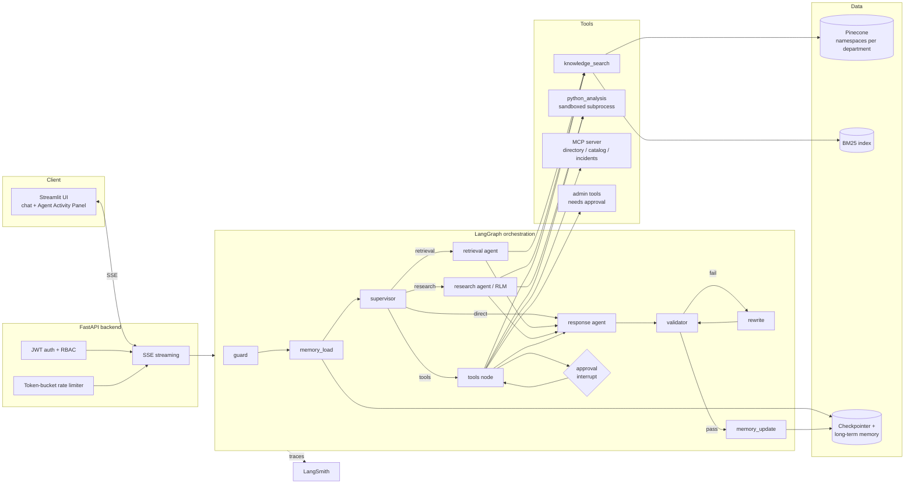

# Architecture

This document explains how the Meridian Knowledge Assistant is put together and, more importantly, *why* each
piece is built the way it is. The audience is an engineer evaluating the design. A plain-language walkthrough
for non-specialists is in `docs/pdf/User_Guide.pdf` (built by `scripts/build_pdfs.py`).

## 1. System overview

A rendered PNG of the same diagram is at `docs/architecture.png`.

## 2. Request lifecycle

1. **UI** posts `{message, thread_id}` to `POST /chat` with a bearer token.
2. **API** validates the token (JWT), consumes one token from the caller's rate-limit bucket, validates the
   message and opens an SSE stream.
3. **LangGraph** runs the graph under the `thread_id` (checkpointed) and the API forwards three streams:
   `custom` (activity events from nodes), `messages` (LLM tokens from the response agent) and `updates`
   (interrupts for human approval).
4. The final state is turned into an `answer` event with the validated text, evidence list, validation
   report, tool results, RLM trace, memory updates and LangSmith run id / URL.

## 3. Agents (graph nodes)

| Node | Responsibility | Model | Failure fallback |
|---|---|---|---|
| `guard` | Input validation, prompt-injection screening | none | block with safe message |
| `memory_load` | Long-term profile + rolling summary of long histories | none | "no prior history" |
| `supervisor` | Intent, decomposition into sub-questions, route, metadata filters, tool plan | primary | plain retrieval, no filters |
| `retrieval` | One hybrid search via `knowledge_search`; adaptive retry without filters | worker (rerank) | empty evidence, `degraded=True` |
| `research` | Recursive Language Model flow (see §5) | primary + worker | evidence gathered so far |
| `tools` | Executes tool plan through the RBAC registry; pauses for approval | none | error tool result |
| `approval` | `interrupt()` - human-in-the-loop for admin tools | none | n/a |
| `response` | Grounded, cited answer (streamed) | primary | evidence list with apology |
| `validator` | Output guardrails; loops to `rewrite` at most twice | none | sanitised answer + disclaimer |
| `rewrite` | Repairs only the reported problems | primary | increments attempt counter |
| `memory_update` | Writes long-term memory; appends AI message to the checkpoint | none | still appends the answer |

**Multi-agent state management.** All agents share one explicit `AssistantState` TypedDict. Nodes only
*return the keys they changed*; LangGraph merges them. Append-only fields (`tool_results`, `rlm_trace`,
`errors`, `node_path`) use reducers so concurrent or repeated nodes never overwrite each other. Because the
state is plain data, every checkpoint is inspectable in LangSmith and via `GET /threads/{id}`.

**Butterfly-effect containment.** Every node is wrapped in `resilient()` (`graph/resilience.py`). A node
failure becomes an `error` event, a line in `state.errors`, `degraded=True`, and a *node-specific* fallback
update that keeps the graph on a safe path. Tools have their own timeouts; RLM batches fail individually;
the rewrite loop is bounded. The response agent is told when the request is degraded so it says so.

## 4. Retrieval design

* **Chunking** - Markdown is split at headings (natural semantic units for runbooks/incident reports), then
  windowed with overlap. Each chunk keeps `title` and `section` for precise attribution.
* **Dense** - embeddings (Voyage / OpenAI / local hashed fallback) stored in **Pinecone** (serverless, cosine),
  one **namespace per department**. When the supervisor infers a department the query hits one namespace;
  otherwise the retriever fans out to all namespaces concurrently (`asyncio.gather`).
* **Sparse** - BM25 (rank-bm25) over the same chunks, with identifier-aware tokenisation so `INC-2025-0419`
  or `PAY-2211` are exact hits. Dense models are notoriously weak at these.
* **Metadata filtering** - `department`, `document_type`, `access_level`, `created_date` are stored with every
  vector. Filters use Pinecone's syntax (`$in`, `$eq`, `$gte`, `$lte`, `$and`); the in-memory store
  implements the same subset so tests and offline mode are faithful.
* **Access control in the query** - the dense filter always includes `access_level $in <levels the user may
  read>` and BM25 applies the same predicate. Content above the user's clearance never becomes a candidate.
  A second check after fusion enforces the rule again (defence in depth).
* **Fusion** - weighted **reciprocal rank fusion**. RRF only uses ranks, so it is immune to the different
  scales of cosine and BM25 scores; the single knob `HYBRID_DENSE_WEIGHT` is exposed.
* **Reranking (bonus)** - listwise LLM grading of the top 2k candidates by the worker model, with a lexical
  fallback when the LLM is unavailable. The rerank scores are visible in the trace and in each evidence item's
  `why` string.
* **Attribution** - each evidence item carries `doc_id`, `title`, `section`, `document_type`, `department`,
  `access_level`, `created_date`, the score and an explanation (`dense=yes sparse=yes rrf=0.0163; rerank(llm)=9.0`).

Trade-off: Pinecone supports native sparse vectors; we kept BM25 local so hybrid works identically on the
in-memory fallback and does not need a hosted sparse encoder. Moving BM25 into Pinecone is a contained change
in `retrieval/sparse.py`.

## 5. Recursive Language Model (research agent)

The brief's example - "Summarise all outage reports related to payment failures during the last year and
identify recurring root causes" - runs like this:

1. **Plan (Python-based search plan).** The primary model writes a short Python snippet that builds
   `plan = [{query, document_types, department, created_after}, ...]`. It runs in the restricted executor
   (`tools/safe_python.py`: AST allow-list, minimal builtins). The code and the resulting plan are emitted to the
   activity panel and the LangSmith trace. A deterministic plan is used if the code fails.
2. **Explore.** All plan steps run concurrently through `knowledge_search` (RBAC + access filtering apply).
   Results are de-duplicated and ordered chronologically into a *document collection*.
3. **Decompose into batches.** The collection is split into batches (`RLM_BATCH_SIZE`, documents kept whole).
   Every chunk gets a *global* evidence id so citations stay stable across sub-agents.
4. **Sub-agents.** Each batch is analysed by an independent worker-model call ("sub-agent") with the
   sub-questions; calls run concurrently under a semaphore. A failed batch is skipped and reported.
5. **Recursive aggregation.** Batch findings are merged in groups of three; the merged outputs are merged
   again until one synthesis remains (depth bounded by `RLM_MAX_DEPTH`).
6. **Structured analysis.** For analysts/admins the `python_analysis` tool computes root-cause-tag and
   per-month counts over the collection metadata in an isolated subprocess. Viewers get a built-in count and
   an explicit note that the analytics tool is not permitted for their role.

The response agent then writes the final summary from the synthesis, keeping the `[n]` citations.

## 6. Tools and MCP

* `tools/registry.py` is the *only* execution path. Order of checks: RBAC -> approval flag -> pydantic
  parameter validation -> `asyncio.wait_for` timeout -> exception containment. The supervisor only *sees*
  tools its user may call, and the registry re-checks at execution. The supervisor node additionally drops any
  tool the LLM proposes that the role may not use and emits a `security` event.
* **MCP.** `mcp_server/server.py` is an MCP 2.x `MCPServer` exposing an employee directory, service catalog
  and incident records. The bridge (`tools/mcp_bridge.py`) discovers its tools at startup and registers each as
  `mcp.<name>` behind `Permission.MCP_TOOLS`, generating pydantic schemas from the MCP JSON schemas. It
  connects in-process by default or over Streamable HTTP when `MCP_SERVER_URL` is set (Docker Compose).
* **Python analysis.** Subprocess isolation (`python -I`), AST policy, hard kill on timeout, JSON in/out.
* **Admin tools** (`escalate_incident`, `reindex_knowledge_base`) require `Permission.ADMIN_TOOLS` *and* a
  human approval through the `approval` node (`interrupt()` -> `POST /chat/resume`).

## 7. Memory

See `docs/MEMORY.md` for the full design. Short version: LangGraph checkpointer per `thread_id` for
working memory (also powers interrupts), deterministic rolling summary for long threads, and a file-backed
per-user long-term profile injected into prompts. Feedback is stored with the profile and forwarded to LangSmith.

## 8. Observability

LangSmith tracing is enabled by environment (`LANGSMITH_API_KEY`). Every turn is one root run (`chat_turn`,
tagged with user and role, `run_id` chosen by the API so the UI can link to it). Child spans: each graph node,
each LLM call (supervisor, plan, batch sub-agents, aggregation, rerank, response, rewrite), each tool call
(`knowledge_search`, `python_analysis`, `mcp.*`) and the retrieval operations inside. Structured logs
(structlog) carry `request_id`, `thread_id`, `user` and `run_id` on every line.

## 9. Async engineering

* FastAPI + uvicorn, async endpoints, SSE via async generators.
* Retrieval: dense fan-out over namespaces with `asyncio.gather`; BM25 on a thread while dense is in flight;
  Pinecone SDK calls run in `asyncio.to_thread` with timeouts.
* RLM: concurrent search steps, concurrent sub-agents (semaphore), concurrent aggregation groups.
* Tools: concurrent execution of the plan, per-tool `wait_for`, subprocess for Python.
* Every external boundary (LLM, embeddings, vector DB, MCP, tools) has an explicit timeout and a typed error.

## 10. Model selection rationale

| Role | Model | Why |
|---|---|---|
| Primary | `claude-opus-5` | Best reasoning for routing, synthesis and grounded, cited writing; adaptive thinking on by default; 1M context if ever needed. |
| Worker | `claude-haiku-4-5` | RLM sub-agents and reranking are high-volume, low-stakes calls where speed and cost dominate. |
| Alternative | OpenAI `gpt-4.1` / `gpt-4.1-mini` | Drop-in via `LLM_PROVIDER=openai`. |
| Offline | deterministic mock | Lets the whole platform run and be tested without credentials. |

Embeddings: Voyage (`voyage-3-lite`) is Anthropic's recommended partner; OpenAI `text-embedding-3-small` is a
common alternative; a hashed local embedder keeps the system runnable offline (quality clearly lower; the
provider is shown on `/health`).
